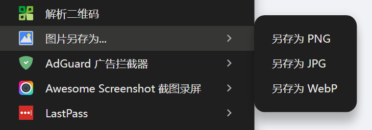

# Save Image As - Chrome Extension

一个实用的 Chrome 浏览器扩展，让你可以轻松地将网页上的图片另存为 PNG、JPG 或 WebP 格式。

## 📸 效果预览



## ✨ 功能特性

- 🖼️ **右键菜单转换**：右键点击图片即可选择保存格式
- 🔄 **多格式支持**：支持 PNG、JPG、WebP 三种格式互转
- 🛡️ **防盗链处理**：自动处理新浪微博等防盗链图片
- 💾 **智能命名**：保留原始文件名，自动更改扩展名
- 🎨 **高质量转换**：JPG 转换质量 95%，保证图片清晰度

## 📦 安装方式

### 方式一：Chrome 网上应用店（推荐）
*即将上架...*

### 方式二：手动安装（开发者模式）

1. 下载或克隆本仓库
   ```bash
   git clone https://github.com/aiyoubucuoyou/save-image-as-chrome-extension.git
   ```

2. 打开 Chrome 浏览器，访问 `chrome://extensions/`

3. 开启右上角的 **开发者模式**

4. 点击 **加载已解压的扩展程序**

5. 选择下载的文件夹

## 🚀 使用方法

1. 在任意网页上找到你想要保存的图片
2. 右键点击图片
3. 选择 **图片另存为...**
4. 选择你想要的格式（PNG、JPG 或 WebP）
5. 选择保存位置，完成！

## 🛠️ 技术实现

- **Manifest V3**：使用最新的 Chrome 扩展规范
- **Offscreen API**：在后台进行图片格式转换，不影响页面性能
- **Canvas API**：使用浏览器原生 Canvas 进行高质量图片处理
- **Context Menus API**：提供友好的右键菜单交互

## 📁 项目结构

```
save-image-as-chrome-extension/
├── manifest.json          # 扩展配置文件
├── background.js          # 后台服务脚本
├── offscreen.html         # 离屏文档 HTML
├── offscreen.js           # 离屏文档脚本
├── icons/                 # 扩展图标
│   ├── icon16.png
│   ├── icon48.png
│   └── icon128.png
├── screenshots/           # 效果截图
│   └── demo.png
└── README.md              # 项目说明文档
```

## 🔧 权限说明

| 权限 | 用途 |
|------|------|
| `contextMenus` | 创建右键菜单 |
| `downloads` | 下载转换后的图片 |
| `offscreen` | 后台图片格式转换 |
| `activeTab` | 访问当前标签页 |
| `scripting` | 注入脚本处理防盗链 |
| `<all_urls>` | 访问任意网站的图片 |

## 🐛 问题反馈

如果你在使用过程中遇到问题，或者有功能建议，欢迎提交 [Issue](https://github.com/aiyoubucuoyou/save-image-as-chrome-extension/issues)。

## 📄 开源协议

本项目基于 [MIT License](LICENSE) 开源。

## 🙏 致谢

感谢所有为这个项目提供建议和反馈的用户！

---

**如果这个扩展对你有帮助，请给个 ⭐ Star 支持一下！**
